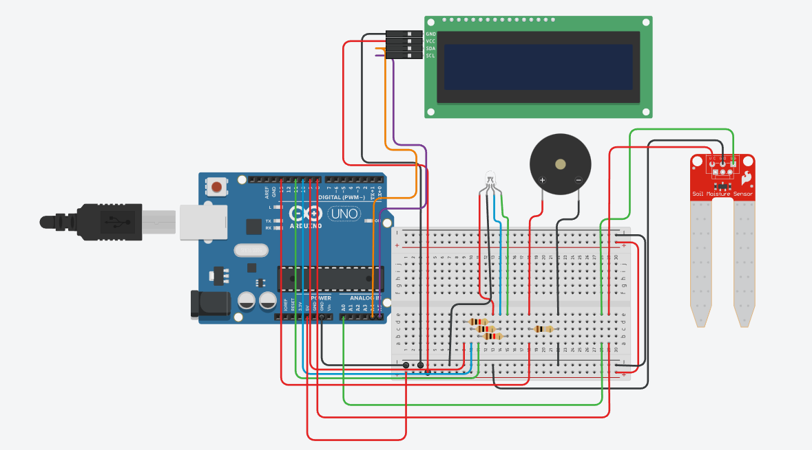
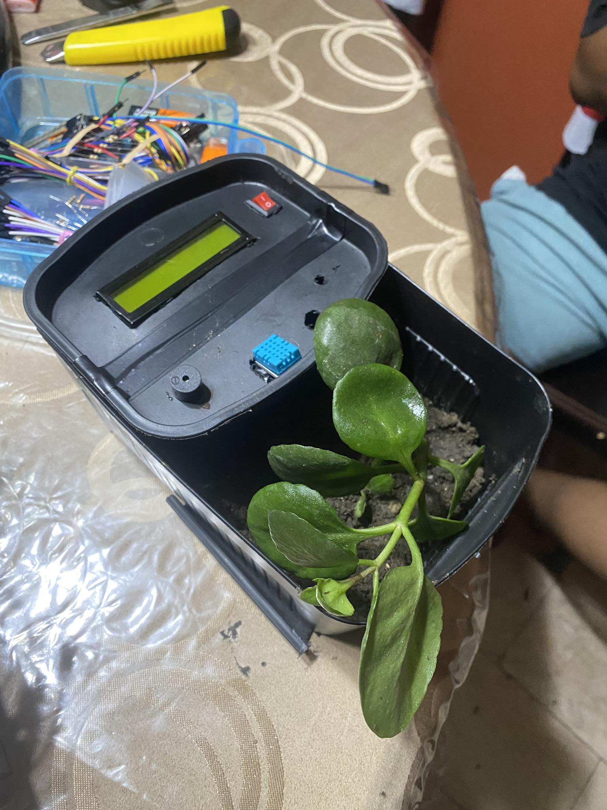

# :potted_plant: Smart Plant Monitoring with Alert System

This project is created by Cabiling's group from SBIT3H section in Quezon City University. This aims to provide a hardware device that monitors a plant alerting an individual about the state whether it is dry or wet. The device monitors the plant base on the soil state, room humidity, and temperature.

## :hammer_and_wrench: Tools and Softwares

Arduino IDE with Libraries

Tinkercad (Optional)

Arduino Uno

Jumper Wires (Male to Male and Male to Female)

DHT11 Sensor (temperature & humidity sensor)

OLED Display SSD1306 (I2C) (128x64) 0.91 inches

Tri-Color LED (Common Anode) (Red, Green, Blue)

Buzzer

## :electric_plug: Circuit Diagram

## :books: Libraries

As the arduino and other components depends on these packages or libraries, we need to install and include these.

LiquidCrystal I2C

Bonezegei_DHT11

## :thermometer: Usage and Calibration

This is the most important part of the project.

1. Temperature & Humidity

The DHT11 sensor reads the ambient room temperature (in °C) and humidity (%).

If the sensor is disconnected, the LCD will display DHT11 Error, but the rest of the system will continue to work.

2. Soil Moisture (CRITICAL STEP)

You MUST calibrate your sensor for accuracy:

Upload the plant_monitor.ino code to your Arduino.

Open the Arduino IDE's Serial Monitor (Tools > Serial Monitor) and set the baud rate to 115200.

Find DRY Value: Hold the sensor in the open air. Note the "Soil Raw" value from the Serial Monitor. This is your DRY_VALUE.

Find WET Value: Submerge the sensor's measurement part in a glass of water. Note the "Soil Raw" value. This is your WET_VALUE.

## Installation and Wirings

|  Component | Pin | Connected to Arduino |
|---------------|-----------|-----------|
| I2C LCD 16x02 |    SDA    |     A4    |
|               |    SCL    |     A5    |
|               |    VCC    |     5V    |
|               |    GND    |     GND   |
|  Soil Sensor  |    AOUT   |     A0    |
|               |    VCC    |     D8    |
|               |    GND    |    GND    |
|    DHT11      |    Data   |     A1    |
|               |    VCC    |     5V    |
|               |    GND    |    GND    |
|    RGB LED    |    Red    |     D9    |
|               |    Blue   |    D10    |
|               |   Green   |    D11    |
|               |   Cathode |    GND    |
|   Buzzer      |Positive(+)|    D13    |
|               |Negative(+)|   GND     |

## 🙏 Acknowledgements

Special thanks to my members who made this project possible:

### **Group 2 of SBIT-3H from Quezon City University**

- **Lead Developer**
    - [tambayNgOrtigasAvenue](https://github.com/tambayNgOrtigasAvenue)
    - Allyana Cabiling (also in Documentation and QA)

- **Documentation**
    - Jan Sumido
    - Jefferson Abarquez
    - Nath Legaspina
    - Alexandria Garcia
    - Carl Sebastian

### Websites and Tools

- [TinkerCad](https://www.tinkercad.com/) - For Circuit Simulation
- [ChatGPT](https://chatgpt.com/) - For Countless Code Suggestion
- [Arduino](https://docs.arduino.cc/) - For an Access to Documentation and Software

## Project Ouput
